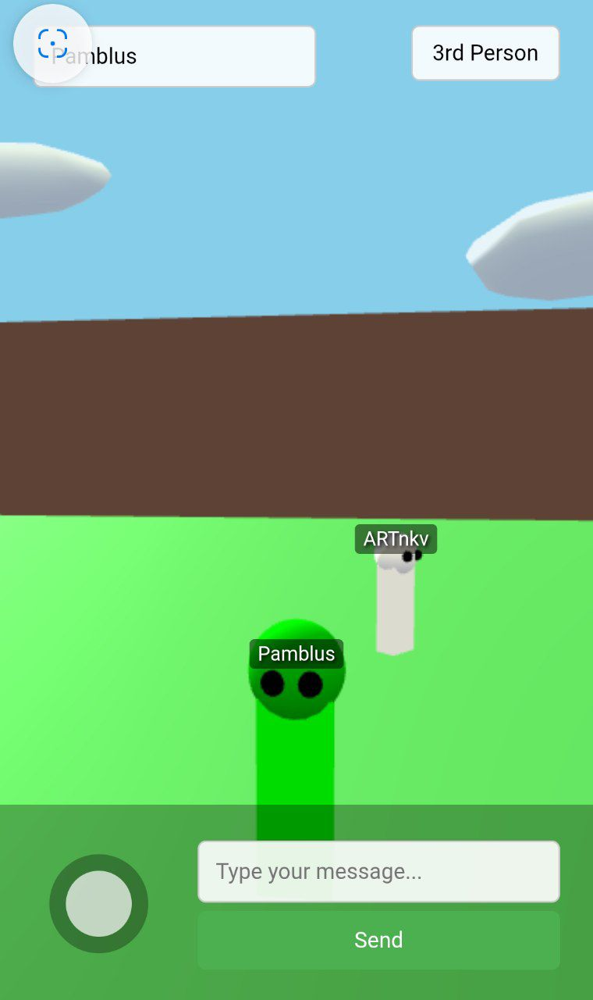

# 3D Multiplayer Room with ThreeJS

## Описание проекта

Это интерактивная 3D комната с мультиплеерной функциональностью, созданная с использованием:
- Three.js для 3D-рендеринга
- WebGL для аппаратного ускорения
- PHP для серверной части (хранения данных игроков)

Проект позволяет нескольким пользователям одновременно находиться в виртуальном пространстве, общаться и взаимодействовать.

## Основные возможности

- **3D окружение** с текстурированными стенами, полом и декорациями
- **Мультиплеер** - видите других игроков в реальном времени
- **Система чата** с отображением сообщений над головами персонажей
- **Адаптивное управление**:
  - Виртуальный джойстик для мобильных устройств
  - Управление мышью для ПК
- **3 режима камеры**:
  - От первого лица
  - От третьего лица
  - Вид сверху

## Технические детали

### Клиентская часть
- Three.js для 3D-графики
- Адаптивный интерфейс для разных устройств
- Оптимизированные элементы управления

### Серверная часть
- PHP скрипты для хранения данных
- Простая JSON-база данных
- Система обновления позиций игроков
